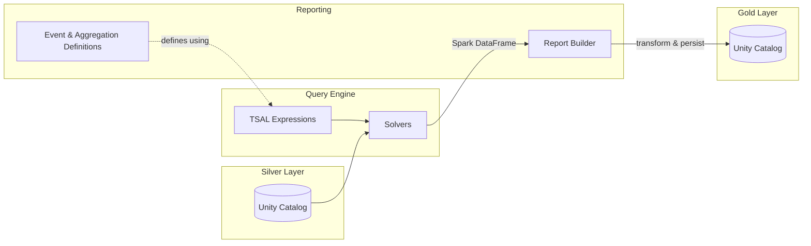

# Impulse

## Documentation

The complete documentation is available at: https://databrickslabs.github.io/impulse

## Overview

Impulse is a Python-based analytics library designed for processing large-scale time-series measurement data. Built on Apache Spark and Delta Lake, it enables distributed processing of petabyte-scale sensor data from automotive testing, industrial IoT, and other measurement-intensive domains.

### Main Components



### Query Engine

The query engine provides access to time-series data and enables flexible data transformation.

- Connects to measurement data stored in Delta Lake / Unity Catalog
- Provides a **Time Series Analytics Language (TSAL)** for defining signals and events using intuitive expressions
- Supports **virtual signals** — computed channels derived from physical measurements (e.g., `power = voltage * current`)
- Executes queries through interchangeable solvers optimized for different silver layer data models or formats
- Results are returned in a Spark Dataframe

### Reporting

The reporting component orchestrates the query engine to produce structured analytical outputs.

- Defines **events** and **aggregations** relevant for a analysis/report using TSAL of the query engine
- Triggers computation of **aggregations** such as histograms and statistics over selected signals and events
- Organizes results into **reports** with pages for logical grouping
- Transforms & persists results to a **star-schema gold layer** in Unity Catalog for downstream analytics

## Key Features

### Time-Series Query Language
- Select physical channels by tags (e.g., `channel_name='Engine RPM'`)
- Create virtual signals via mathematical expressions
- Filter by container/channel tags and metrics

### Event Detection
- Define events using boolean time-series expressions
- Extract event instances with start/end timestamps
- Determine aggregations in events only

### Aggregations
- 1D histograms with custom bin configurations
- 2D histograms (heatmaps) for correlation analysis
- Statistics (e.g. min, max, mean) within events

### Data Persistence
- Star schema (dimension/fact tables)
- Gold layer storage in Unity Catalog
- Fact tables: `histogram_fact`, `histogram2d_fact`, `stats_aggregator_fact`, `event_instance_fact`
- Dimension tables: `histogram_dimension`, `histogram2d_dimension`, `stats_aggregator_dimension`, `event_dimension`, `measurement_dimension`

### Spark Integration
- Built on PySpark for distributed processing
- Native Delta Lake and Unity Catalog support
- Optimized for large-scale time-series data

## Data Architecture

### Silver Layer (Input)

| Table | Description |
|-------|-------------|
| `container_metrics` | Measurement metadata (start/stop times, duration) |
| `container_tags` | Key-value tags for containers |
| `channel_metrics` | Channel-level statistics (min, max, mean, sample_count) |
| `channel_tags` | Key-value tags for channels |
| `channels` | Time-series data (container_id, channel_id, timestamps, values) |

### Gold Layer (Output)

| Table | Description |
|-------|-------------|
| `measurement_dimension` | Measurement metadata |
| `event_dimension` | Event definitions |
| `event_instance_fact` | Event occurrences |
| `histogram_dimension` | Histogram metadata |
| `histogram_fact` | Histogram data |
| `histogram2d_dimension` | 2D histogram metadata |
| `histogram2d_fact` | 2D histogram data |
| `stats_aggregator_dimension` | Statistics aggregation metadata |
| `stats_aggregator_fact` | Statistics values per signal, event instance, and container |

## Project Structure

```
impulse/
├── src/
│   ├── mda_query_engine/     # Query engine for time-series data
│   └── mda_reporting/        # Reporting framework
├── tests/                    # Unit and integration tests
├── demos/                    # Example notebooks and configurations
├── docs/impulse/             # Documentation (Docusaurus site)
└── pyproject.toml            # Project configuration and dependencies
```

## Demo & Test Data

The test fixtures (`tests/data/`) and demo datasets (`demos/data/`) are derived from the
**Automotive OBD-II Dataset** published by the Karlsruhe Institute of Technology (KIT):

> Weber, Marc (2019). *Automotive OBD-II Dataset*.
> Institute for Information Processing Technology (ITIV), KIT.
> DOI: [10.5445/IR/1000085073](https://doi.org/10.5445/IR/1000085073)

The original dataset contains ten vehicle signals (engine RPM, vehicle speed, temperatures,
pressures, throttle position, and air flow rate) recorded via the OBD-II interface on
various driving routes. It is licensed under the
[Creative Commons Attribution 4.0 International (CC BY 4.0)](https://creativecommons.org/licenses/by/4.0/) license.

The data has been restructured into the framework's silver-layer table schema
(containers, channels, tags, and metrics) for use in tests and demos.

## Requirements

**Python Version:** `>= 3.12, < 3.13`

### Core Dependencies

| Package | Version | Purpose |
|---------|---------|---------|
| `pyspark` | 4.0.0 | Spark processing engine |
| `delta-spark` | 4.0.1 | Delta Lake support |
| `pyarrow` | 19.0.1 | Columnar data processing |
| `pandas` | 2.2.3 | DataFrame operations |
| `pydantic` | 2.11.7 | Configuration validation |
| `scipy` | 1.15.1 | Scientific computing |
| `matplotlib` | 3.10.0 | Visualization |
| `lz4` | 4.4.5 | Compression (time-series encoding) |
| `nptyping` | ~2.5.0 | NumPy type hints |

## Usage

### Basic Workflow

1. Create a `Report` with configuration (JSON or dictionary)
2. Define channels (physical or virtual) using the query builder
3. Define events using time-series expressions
4. Create aggregations (histograms, statistics) and add them to report pages
5. Call `determine_report()` to compute results
6. Call `persist_results()` to write to Unity Catalog

### Example

```python
from databricks.sdk import WorkspaceClient

from mda_reporting.core.report import Report
from mda_reporting.core.page import Page
from mda_reporting.events.basic_event import BasicEvent
from mda_reporting.aggregations.histogram import HistogramDuration

# Create the report. `workspace_client` is used for telemetry attribution;
# `spark` is an active SparkSession available in Databricks notebooks.
ws = WorkspaceClient()
report = Report(name="my_report", spark=spark, workspace_client=ws, config=my_config)

# Select a physical channel by its metadata tags.
db = report.get_db()
engine_rpm = db.query.channel(channel_name="Engine RPM")

# Define an event (time windows where RPM > 5000) and register it with the report.
high_rpm_event = BasicEvent(
    name="high_rpm",
    expr=(engine_rpm > 5000),
    desc="Engine RPM above 5000",
)
report.add_event(high_rpm_event)

# Create a page, attach a histogram scoped to the event, and add the page.
page = Page(page_number=1)
page.add_aggregation(
    HistogramDuration(
        name="rpm_distribution",
        base_expr=engine_rpm,
        bins=[float(i) for i in range(0, 8000, 160)],
        event=high_rpm_event,
    )
)
report.add_page(page)

# Compute and persist.
report.determine_report()
report.persist_results()
```

## Development

### Testing

```bash
pytest                    # Run tests
pytest --cov              # Run tests with coverage
pytest --benchmark        # Run benchmarks
```

### Code Quality

```bash
ruff check .              # Linting
black .                   # Code formatting
pre-commit run --all      # Run all pre-commit hooks
```

---

## Project Support

Please note that this project is provided for your exploration only and is not formally supported by Databricks with Service Level Agreements (SLAs). It is provided AS-IS and we do not make any guarantees of any kind. Please do not submit a support ticket relating to any issues arising from the use of this project.

Any issues discovered through the use of this project should be filed as GitHub Issues on this repository. They will be reviewed as time permits, but no formal SLAs for support exist.

---
