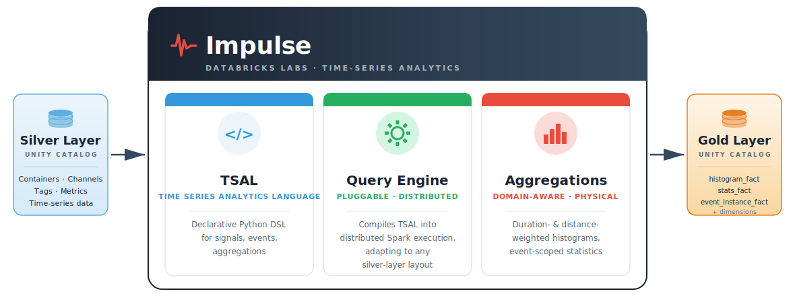

## Documentation

The complete documentation is available at: https://databrickslabs.github.io/impulse

## Overview

Impulse is a Python-based analytics library designed for processing large-scale time-series measurement data. Built on Apache Spark and Delta Lake, it enables distributed processing of petabyte-scale sensor data from automotive testing, industrial IoT, and other measurement-intensive domains.

## Architecture



Impulse sits between a governed silver layer and a gold-layer star schema in Unity Catalog and provides three components:

- **TSAL (Time Series Analytics Language)** — a declarative Python DSL for expressing signals, events, and aggregations in natural Python, without requiring Spark expertise.
- **Query Engine** — pluggable and distributed; compiles TSAL expressions into Spark execution plans and adapts to any silver-layer layout via interchangeable solvers.
- **Aggregations** — domain-aware physical aggregations, including duration- and distance-weighted 1D/2D histograms and event-scoped statistics.

### Usage modes

The same TSAL core and query engine support three complementary usage modes:

- **Reporting** — events and aggregations are executed in parallel across all matching recordings and persisted to the gold-layer star schema, ready for AI/BI Dashboards or Lakehouse Apps. Pipelines can be scheduled as Databricks Workflows.
- **Ad-hoc analysis** — TSAL expressions are evaluated directly by the query engine and returned as Spark DataFrames for interactive exploration in notebooks, without writing to the gold layer.
- **ML** — event-scoped statistics and histogram distributions are extracted as flat feature matrices that can be passed directly to MLflow, AutoML, or custom training pipelines.

## Data Architecture

- The **silver layer** is a domain-specific data model for measurement data, organized around two concepts: A **container** groups a set of recordings (e.g. one test drive), and a **channel** is an individual sensor signal within a container.
- The time-series data itself lives in a very narrow table keyed by container and channel, complemented by `*_tags` and `*_metrics` tables that carry contextual metadata and statistics at both the container and channel level.
- The **gold layer** is a star schema with fact tables (`histogram_fact`, `histogram2d_fact`, `stats_aggregator_fact`, `event_instance_fact`) and matching dimension tables.
- See the [Impulse documentation](https://databrickslabs.github.io/impulse) for more details on the silver-layer and gold-layer data models. A detailed explanation of the silver-layer model is also described in [this Databricks blog post](https://www.databricks.com/blog/revolutionizing-car-measurement-data-storage-and-analysis-mercedes-benzs-petabyte-scale).

## Quickstart

The example below demonstrates the **reporting** usage mode. Examples of the ad-hoc analysis and ML modes are available in the [documentation](https://databrickslabs.github.io/impulse) and the [demos/](demos/) folder.

```python
from databricks.sdk import WorkspaceClient

from impulse_reporting.core.report import Report
from impulse_reporting.core.page import Page
from impulse_reporting.events.basic_event import BasicEvent
from impulse_reporting.aggregations.histogram import HistogramDuration

ws = WorkspaceClient()
report = Report(name="battery_thermal", spark=spark, workspace_client=ws, config=my_config)

# Select physical channels and define a virtual signal.
query = report.get_db().query
max_cell_temp = query.channel(channel_name="Battery_Cell_Temp_Max", platform="EV")
min_cell_temp = query.channel(channel_name="Battery_Cell_Temp_Min", platform="EV")
temp_delta = max_cell_temp - min_cell_temp

# Define an event: max cell temp >= 60 °C OR cell-to-cell delta > 5 °C.
thermal_risk = BasicEvent(name="thermal_runaway_risk",
    expr=(max_cell_temp >= 60.0) | (temp_delta > 5.0),
)
report.add_event(thermal_risk)

# Duration-weighted histogram of max cell temperature, scoped to the event.
page = Page(page_number=1)
page.add_aggregation(
    HistogramDuration(
        name="critical_temp_distribution",
        base_expr=max_cell_temp,
        bins=[float(i) for i in range(60, 100, 2)],
        event=thermal_risk,
        bins_unit="°C",
        values_unit="s",
    )
)
report.add_page(page)

# Compute and persist to the Gold-layer star schema.
report.determine_report()
report.persist_results()
```

## Requirements

Python 3.12, PySpark 4.0, Delta Lake 4.0. The full dependency list is in [pyproject.toml](pyproject.toml).

## Demo & Test Data

The test fixtures (`tests/data/`) and demo datasets (`demos/data/`) are derived from the
**Automotive OBD-II Dataset** published by the Karlsruhe Institute of Technology (KIT):

> Weber, Marc (2019). *Automotive OBD-II Dataset*.
> Institute for Information Processing Technology (ITIV), KIT.
> DOI: [10.5445/IR/1000085073](https://doi.org/10.5445/IR/1000085073)

The original dataset contains ten vehicle signals (engine RPM, vehicle speed, temperatures,
pressures, throttle position, and air flow rate) recorded via the OBD-II interface on
various driving routes. It is licensed under the
[Creative Commons Attribution 4.0 International (CC BY 4.0)](https://creativecommons.org/licenses/by/4.0/) license.

The data has been restructured into the framework's silver-layer table schema
(containers, channels, tags, and metrics) for use in tests and demos.

## Contributing

Contributions are welcome! See [CONTRIBUTING.md](CONTRIBUTING.md) for development setup,
testing, code style, and the pull-request workflow.

---

## Project Support

Please note that this project is provided for your exploration only and is not formally supported by Databricks with Service Level Agreements (SLAs). It is provided AS-IS and we do not make any guarantees of any kind. Please do not submit a support ticket relating to any issues arising from the use of this project.

Any issues discovered through the use of this project should be filed as GitHub Issues on this repository. They will be reviewed as time permits, but no formal SLAs for support exist.
