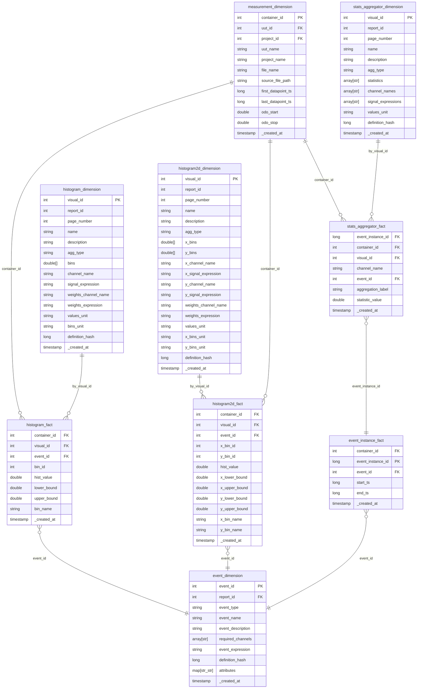

# Gold Layer - ER Diagram

The Gold layer follows a star schema optimizing storage cost and query performance. 
Each aggregation type (histogram, histogram2d, statistics) has its own fact/dimension pair linked by `visual_id`. 

Fact tables join back to containers via `container_id` and to events via `event_id` or `event_instance_id`.

