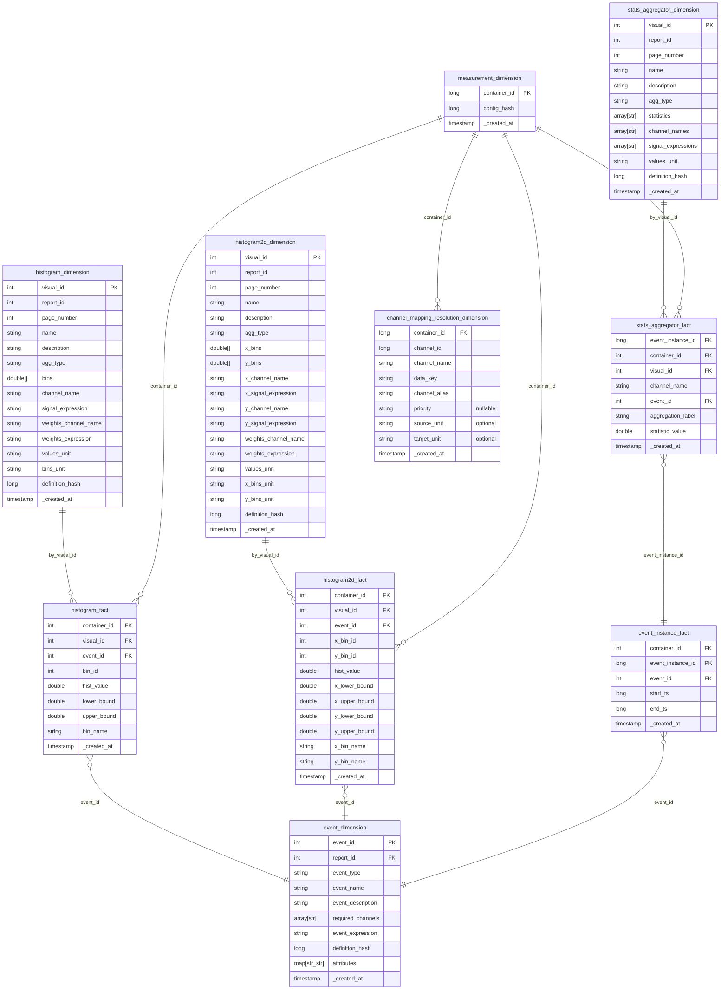

# Gold Layer Schema

The Gold layer follows a star schema optimizing storage cost and query
performance. Each aggregation type (histogram, histogram2d, statistics)
has its own fact/dimension pair linked by `visual_id`. Fact tables join
back to containers via `container_id` and to events via `event_id` or
`event_instance_id`.

All gold-layer table names are prefixed with the configured
`table_prefix` from the report's sink config (e.g. with
`table_prefix: "my_report"` the histogram fact table becomes
`my_report_histogram_fact`).

## Entity-relationship diagram

The `measurement_dimension` table also contains additional columns
selected dynamically from
[`config.measurement_dimensions`](../config/configuration.md#measurement_dimensions-optional)
at run time — only `container_id`, `config_hash`, and `_created_at` are
guaranteed.

---

## Fact tables

| Table                            | Key columns                                                                            | Description                                                  |
|----------------------------------|----------------------------------------------------------------------------------------|--------------------------------------------------------------|
| `{prefix}_histogram_fact`        | `container_id`, `visual_id`, `event_id`, `bin_id`                                      | 1D histogram bin values per container.                       |
| `{prefix}_histogram2d_fact`      | `container_id`, `visual_id`, `event_id`, `x_bin_id`, `y_bin_id`                        | 2D histogram bin values per container.                       |
| `{prefix}_stats_aggregator_fact` | `container_id`, `visual_id`, `event_instance_id`, `channel_name`, `aggregation_label`  | Statistics values per signal, event instance, and container. |
| `{prefix}_event_instance_fact`   | `container_id`, `event_id`, `event_instance_id`                                        | Materialized event occurrences with start/end timestamps.    |

---

## Dimension tables

| Table                                 | Key columns              | Description                                                |
|---------------------------------------|--------------------------|------------------------------------------------------------|
| `{prefix}_histogram_dimension`        | `visual_id`, `report_id` | Histogram metadata (name, bins, signal info, units).       |
| `{prefix}_histogram2d_dimension`      | `visual_id`, `report_id` | 2D histogram metadata (axes, bins, signal info, units).    |
| `{prefix}_stats_aggregator_dimension` | `visual_id`, `report_id` | Statistics metadata (signals, aggregation labels).         |
| `{prefix}_event_dimension`            | `event_id`, `report_id`  | Event definitions (name, expression, required channels).   |
| `{prefix}_measurement_dimension`      | `container_id`           | Container metadata. Always carries `container_id`, `config_hash`, `_created_at`; additional columns are populated from [`config.measurement_dimensions`](../config/configuration.md#measurement_dimensions-optional). |
| `{prefix}_channel_mapping_resolution_dimension` | `container_id`, `channel_id`, `channel_alias` | Resolves each channel alias to its physical channel per container (physical join keys, alias `priority`). Written only when the report uses aliased selectors. The `source_unit` / `target_unit` columns are present only when a [`config.unit_conversion_table`](../config/configuration.md) is configured. |

The `channel_mapping_resolution_dimension` table lets BI consumers join a fact
back to the physical channel that an alias resolved to: join on
`(container_id, channel_id, channel_alias)`. The join-key, `channel_alias`,
`priority`, and `source_unit` / `target_unit` column names follow the
[`channel_mapping` solver config](../config/configuration.md) — see the column
reference there for how each maps to the alias and metrics tables.
