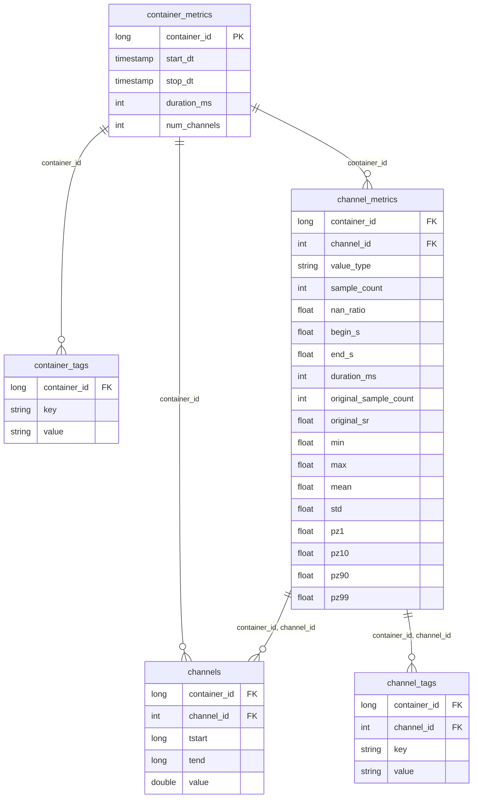

# Silver Layer Schema

The Silver layer stores measurement data in a normalized, tag-based model.
Time-series samples live in `channels`; metadata is split across tag
tables (EAV key-value pairs) and metric tables (pre-computed statistics).

The five tables and columns on this page describe the **typical
default-solver shape** — what Impulse's default solvers
(`DeltaSolver`, `BasicNarrowSolver`, `KeyValueStoreSolver`) expect when
no [`SolverConfig`](../config/configuration.md#solver-column-mappings-and-filters)
overrides are applied. The framework hard-requires only a small subset of this shape:

- `container_id` on every silver table (engine join key);
- `(container_id, channel_id)` on the channel-side tables and `channels`;
- `key`, `value` columns on the tag tables (EAV layout);
- one of the two `channels` formats below (RLE with `tstart`/`tend` or
  raw with `timestamp`).

Any other column on `container_metrics` and `channel_metrics` is
optional and only consulted when referenced by your config (e.g. via
[`measurement_dimensions`](../config/configuration.md#measurement_dimensions-optional)
or `metric_filters`). For physical layouts that diverge further, see
[Adapting to existing data layouts](ingestion.md#adapting-to-existing-data-layouts).

## Entity-relationship diagram

---

## container_metrics

One row per measurement container with timestamps, duration, and channel
count.

| Column         | Type        | Nullable | Description                          |
|----------------|-------------|----------|--------------------------------------|
| `container_id` | `long`      | No       | Unique container identifier.         |
| `start_dt`     | `timestamp` | Yes      | Container start datetime.            |
| `stop_dt`      | `timestamp` | Yes      | Container stop datetime.             |
| `duration_ms`  | `int`       | Yes      | Total duration in milliseconds.      |
| `num_channels` | `int`       | Yes      | Number of channels in the container. |

### Additional columns commonly populated

`container_metrics` typically carries additional metadata columns that
get surfaced into the gold-layer `measurement_dimension` table when
listed in the report's
[`measurement_dimensions`](../config/configuration.md#measurement_dimensions-optional)
config. The framework recognises the following names through the
`MeasurementDimensions` enum — populate any subset that fits your
data; none are required by the engine.

| Column             | Type     | Description                                  |
|--------------------|----------|----------------------------------------------|
| `uut_id`           | `long`   | Unit-under-test identifier.                  |
| `vehicle_key`      | `string` | Vehicle identifier.                          |
| `project_id`       | `long`   | Project identifier.                          |
| `file_name`        | `string` | Source measurement file name.                |
| `source_file_path` | `string` | Full path to the source file.                |
| `start_ts`         | `long`   | Measurement start timestamp (epoch).         |
| `stop_ts`          | `long`   | Measurement stop timestamp (epoch).          |
| `environment`      | `string` | Recording environment (e.g. PUMA, datalogger). |

:::note Two timestamp conventions

`start_dt`/`stop_dt` (datetime, listed in the table at the top of this
section) and `start_ts`/`stop_ts` (epoch long, listed here) are
**different columns**, not naming variants. Real-world
`container_metrics` tables typically carry both: `start_dt`/`stop_dt`
for human-readable display, `start_ts`/`stop_ts` for the gold
`measurement_dimension` because the corresponding
`MeasurementDimensions` enum values map to the epoch-typed columns.
Populate whichever your queries and `measurement_dimensions` config
need.

:::

---

## container_tags

Key-value metadata tags for measurement containers. Strict EAV layout —
TSAL queries select recordings by tag key (e.g.
`query.havingTag(vehicle_key="Seat_Leon")` looks up `value` where
`key = 'vehicle_key'`).

| Column         | Type     | Nullable | Description                                     |
|----------------|----------|----------|-------------------------------------------------|
| `container_id` | `long`   | No       | Unique container identifier.                    |
| `key`          | `string` | Yes      | Tag key (e.g. `"vehicle_key"`, `"project_id"`). |
| `value`        | `string` | Yes      | Tag value.                                      |

---

## channel_metrics

Pre-computed statistics per channel. The percentile columns (`pz1`,
`pz10`, `pz90`, `pz99`) and `nan_ratio` enable container/channel
pre-filtering before scanning the much larger `channels` table.

| Column                  | Type     | Nullable | Description                       |
|-------------------------|----------|----------|-----------------------------------|
| `container_id`          | `long`   | No       | Parent container identifier.      |
| `channel_id`            | `int`    | No       | Channel identifier.               |
| `value_type`            | `string` | Yes      | Data type of channel values.      |
| `sample_count`          | `int`    | Yes      | Number of samples.                |
| `nan_ratio`             | `float`  | Yes      | Ratio of NaN values.              |
| `begin_s`               | `float`  | Yes      | Channel start time (seconds).     |
| `end_s`                 | `float`  | Yes      | Channel end time (seconds).       |
| `duration_ms`           | `int`    | Yes      | Channel duration in milliseconds. |
| `original_sample_count` | `int`    | Yes      | Sample count before processing.   |
| `original_sr`           | `float`  | Yes      | Original sample rate.             |
| `min`                   | `float`  | Yes      | Minimum value.                    |
| `max`                   | `float`  | Yes      | Maximum value.                    |
| `mean`                  | `float`  | Yes      | Mean value.                       |
| `std`                   | `float`  | Yes      | Standard deviation.               |
| `pz1`                   | `float`  | Yes      | 1st percentile.                   |
| `pz10`                  | `float`  | Yes      | 10th percentile.                  |
| `pz90`                  | `float`  | Yes      | 90th percentile.                  |
| `pz99`                  | `float`  | Yes      | 99th percentile.                  |

---

## channel_tags

Key-value metadata tags per channel. Strict EAV layout — TSAL channel
selectors look up signals by tag key (e.g.
`query.channel(channel_name="Engine_RPM")` looks up `value` where
`key = 'channel_name'`).

| Column         | Type     | Nullable | Description                                            |
|----------------|----------|----------|--------------------------------------------------------|
| `container_id` | `long`   | No       | Parent container identifier.                           |
| `channel_id`   | `int`    | No       | Channel identifier within the container.               |
| `key`          | `string` | Yes      | Tag key (e.g. `"channel_name"`, `"brand"`, `"model"`). |
| `value`        | `string` | Yes      | Tag value.                                             |

---

## channels

The actual time-series data. Two format variants are supported.

### RLE format (default)

Pre-encoded with run-length encoding. Each row represents one sample
interval `[tstart, tend)` with a constant value. Used when
`data_type` is omitted or set to `RLE` in the report config.

| Column         | Type     | Nullable | Description                            |
|----------------|----------|----------|----------------------------------------|
| `container_id` | `long`   | No       | Parent container identifier.           |
| `channel_id`   | `int`    | No       | Channel identifier.                    |
| `tstart`       | `long`   | No       | Sample start timestamp (microseconds). |
| `tend`         | `long`   | No       | Sample end timestamp (microseconds).   |
| `value`        | `double` | Yes      | Sample value.                          |

### Raw format

Raw timestamp-based data without RLE encoding — one row per sample. Used
when `data_type: RAW` is set in the report config; the engine derives
`tend` from subsequent timestamps and transforms the data into RLE before
query execution.

| Column         | Type     | Nullable | Description                      |
|----------------|----------|----------|----------------------------------|
| `container_id` | `long`   | No       | Parent container identifier.     |
| `channel_id`   | `int`    | No       | Channel identifier.              |
| `timestamp`    | `long`   | No       | Sample timestamp (microseconds). |
| `value`        | `double` | Yes      | Sample value.                    |

### Optional `is_plausible` column

An optional `is_plausible: boolean` column may be present on `channels`
in either format. It is **only consulted** when the solver is
constructed with `drop_implausible_data=True` — in that mode, samples
with `is_plausible = False` are filtered before RLE encoding. If the
flag is `False` (the default), the column is ignored and may be omitted.

---

## channel_mapping (optional)

Alias-resolution table used by `KeyValueStoreSolver` when selectors are
created via `QueryBuilder.channel_with_alias()`. Each row maps a logical
channel name to one or more physical channels keyed by `project_id` /
`data_key`, with an optional `priority` tie-breaker.

| Column         | Type     | Nullable | Description                                                           |
|----------------|----------|----------|-----------------------------------------------------------------------|
| `project_id`   | `int`    | No       | Project identifier the mapping belongs to.                            |
| `concept_id`   | `int`    | No       | Concept identifier (foreign key to the concept table).                |
| `element_id`   | `int`    | No       | Element identifier (foreign key to the concept-elements table).       |
| `project_name` | `string` | Yes      | Human-readable project name.                                          |
| `element_name` | `string` | Yes      | Human-readable element name.                                          |
| `channel_name` | `string` | No       | Logical channel name to match against `channel_with_alias` selectors. |
| `data_key`     | `string` | No       | Physical lookup key joined to `channel_metrics`.                      |
| `priority`     | `int`    | Yes      | Tie-breaker when multiple physical channels match a logical name.     |

Configured via `source.channel_mapping_table` (see
[Configuration](../config/configuration.md)). Joins to `channel_metrics`
on `(project_id, data_key, channel_name)`.
