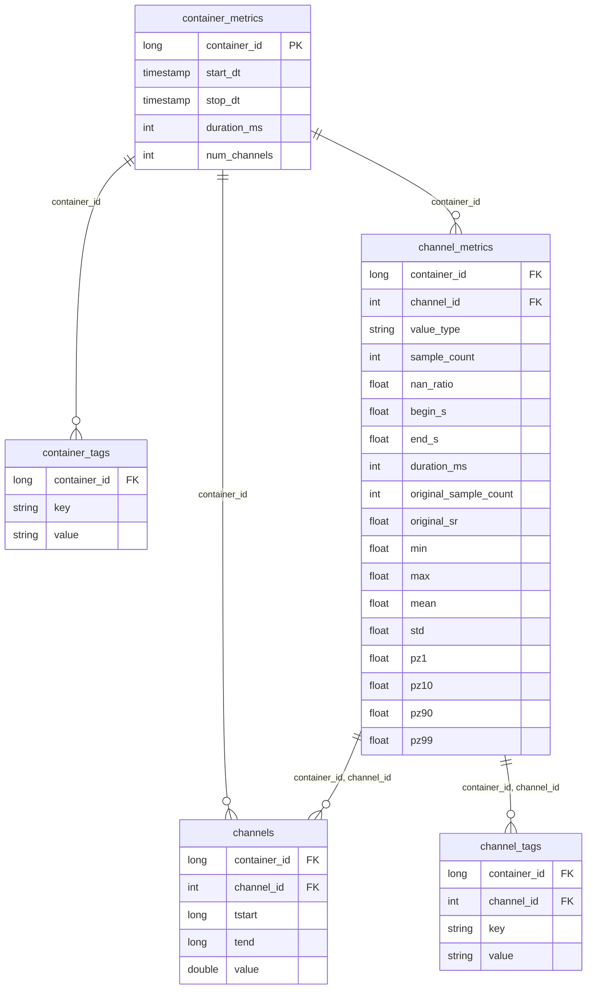

# Silver Layer Schema

The Silver layer stores measurement data in a normalized, tag-based model.
Time-series samples live in `channels`; metadata is split across tag
tables (EAV key-value pairs) and metric tables (pre-computed statistics).

The five tables and columns on this page describe the **typical
default-solver shape** — what Impulse's
[default solvers](../references/query_engine.md)
(`DeltaSolver`, `KeyValueStoreSolver`) expect when
no [`SolverConfig`](../config/configuration.md#solver-column-mappings-and-filters)
overrides are applied. The framework hard-requires only a small subset of this shape:

- `container_id` on every silver table (engine join key);
- `(container_id, channel_id)` on the channel-side tables and `channels`;
- `key`, `value` columns on the tag tables (EAV layout);
- one of the two `channels` formats below (RLE with `tstart`/`tend` or
  raw with `timestamp`).

Any other column on `container_metrics` and `channel_metrics` is
optional and only consulted when referenced by your config (e.g. via
[`measurement_dimensions`](../config/configuration.md#measurement_dimensions-optional)
or `metric_filters`). For physical layouts that diverge further, see
[Adapting to existing data layouts](ingestion.md#adapting-to-existing-data-layouts).

## Entity-relationship diagram

---

## container_metrics

One row per measurement container with timestamps, duration, and channel
count.

| Column         | Type        | Nullable | Description                          |
|----------------|-------------|----------|--------------------------------------|
| `container_id` | `long`      | No       | Unique container identifier.         |
| `start_dt`     | `timestamp` | Yes      | Container start datetime.            |
| `stop_dt`      | `timestamp` | Yes      | Container stop datetime.             |
| `duration_ms`  | `int`       | Yes      | Total duration in milliseconds.      |
| `num_channels` | `int`       | Yes      | Number of channels in the container. |

#### Internal columns referenced by the framework

The framework hard-references the following internal names on `container_metrics`. Map any silver column to one of these via
[`solver_config.container_metrics.column_name_mapping`](../config/configuration.md#solver-column-mappings-and-filters)
when your physical column has a different name.

| Internal name | Referenced by                                                                 |
|---------------|-------------------------------------------------------------------------------|
| `container_id`| Join key against `container_tags`, upsert key in incremental mode             |
| `start_ts`    | `ContainerEvent` event-fact `start_ts`; default `measurement_dimensions` entry |
| `stop_ts`     | `ContainerEvent` event-fact `end_ts`; default `measurement_dimensions` entry  |
| `project_id`  | `KeyValueStoreSolver` project scoping (when `solver_config.project_id` is set) |

Every other column on `container_metrics` is **pass-through**: it lands in
the gold `measurement_dimension` table verbatim if you list it in
[`measurement_dimensions`](../config/configuration.md#measurement_dimensions-optional),
and can be used in `container_filters.metric_filters`; the framework does
not reference it under any specific internal name. Both `measurement_dimensions`
entries and `metric_filters.column_name` references are matched against
the **post-mapping** (internal) column names — i.e. after
[`solver_config.container_metrics.column_name_mapping`](../config/configuration.md#solver-column-mappings-and-filters)
has been applied. If your physical silver column has a different name,
add it to that mapping and reference the internal name here.

### Additional columns commonly populated

`container_metrics` typically carries additional metadata columns that
get surfaced into the gold-layer `measurement_dimension` table when
listed in the report's
[`measurement_dimensions`](../config/configuration.md#measurement_dimensions-optional)
config. Any column you list there must exist on this table under its
**post-mapping** (internal) name — see
[`column_name_mapping`](../config/configuration.md#solver-column-mappings-and-filters)
for how physical-to-internal renaming works. Those internal names pass
through to gold unchanged. The columns below are common choices, but
`measurement_dimensions` accepts any column you carry on this table.

| Column        | Type     | Description                                  |
|---------------|----------|----------------------------------------------|
| `uut_id`      | `long`   | Unit-under-test identifier.                  |
| `vehicle_key` | `string` | Vehicle identifier.                          |
| `project`     | `long`   | Project identifier.                          |
| `file_name`   | `string` | Source measurement file name.                |
| `file_path`   | `string` | Full path to the source file.                |
| `start_ts`    | `long`   | Measurement start timestamp (epoch).         |
| `stop_ts`    | `long`   | Measurement stop timestamp (epoch).          |
| `environment` | `string` | Recording environment (e.g. PUMA, datalogger). |

:::note Two timestamp conventions

`start_dt`/`stop_dt` (datetime, listed in the table at the top of this
section) and `start_ts`/`stop_ts` (epoch long, listed here) are
**different columns**, not naming variants. Real-world
`container_metrics` tables typically carry both: `start_dt`/`stop_dt`
for human-readable display, `start_ts`/`stop_ts` for the gold
`measurement_dimension` (the default `measurement_dimensions` includes
the epoch-typed pair). Populate whichever your queries and
`measurement_dimensions` config need.

:::

---

## container_tags

Key-value metadata tags for measurement containers. Strict EAV layout —
TSAL queries select recordings by tag key (e.g.
`query.havingTag(vehicle_key="Seat_Leon")` looks up `value` where
`key = 'vehicle_key'`).

| Column         | Type     | Nullable | Description                                     |
|----------------|----------|----------|-------------------------------------------------|
| `container_id` | `long`   | No       | Unique container identifier.                    |
| `key`          | `string` | Yes      | Tag key (e.g. `"vehicle_key"`, `"project_id"`). |
| `value`        | `string` | Yes      | Tag value.                                      |

#### Internal columns referenced by the framework

Map any silver column to these via
[`solver_config.container_tags.column_name_mapping`](../config/configuration.md#solver-column-mappings-and-filters)
when your physical column has a different name.

| Internal name | Referenced by                                                                                  |
|---------------|------------------------------------------------------------------------------------------------|
| `container_id`| Join key into `container_metrics` after tag filtering                                          |
| `key`         | EAV pivot key — driven by `query.havingTag(...)` and `container_filters.tag_filters`           |
| `value`       | EAV pivot value — driven by `query.havingTag(...)` and `container_filters.tag_filters`         |
| `project_id`  | `KeyValueStoreSolver` project scoping (when `solver_config.project_id` is set, and this table carries a project column) |
| `parent_id`   | Optional per-table filter target (e.g. `solver_config.container_tags.filters = {"parent_id": ...}`) |

---

## channel_metrics

Pre-computed statistics per channel. The percentile columns (`pz1`,
`pz10`, `pz90`, `pz99`) and `nan_ratio` enable container/channel
pre-filtering before scanning the much larger `channels` table.

| Column                  | Type     | Nullable | Description                       |
|-------------------------|----------|----------|-----------------------------------|
| `container_id`          | `long`   | No       | Parent container identifier.      |
| `channel_id`            | `int`    | No       | Channel identifier.               |
| `value_type`            | `string` | Yes      | Data type of channel values.      |
| `sample_count`          | `int`    | Yes      | Number of samples.                |
| `nan_ratio`             | `float`  | Yes      | Ratio of NaN values.              |
| `begin_s`               | `float`  | Yes      | Channel start time (seconds).     |
| `end_s`                 | `float`  | Yes      | Channel end time (seconds).       |
| `duration_ms`           | `int`    | Yes      | Channel duration in milliseconds. |
| `original_sample_count` | `int`    | Yes      | Sample count before processing.   |
| `original_sr`           | `float`  | Yes      | Original sample rate.             |
| `min`                   | `float`  | Yes      | Minimum value.                    |
| `max`                   | `float`  | Yes      | Maximum value.                    |
| `mean`                  | `float`  | Yes      | Mean value.                       |
| `std`                   | `float`  | Yes      | Standard deviation.               |
| `pz1`                   | `float`  | Yes      | 1st percentile.                   |
| `pz10`                  | `float`  | Yes      | 10th percentile.                  |
| `pz90`                  | `float`  | Yes      | 90th percentile.                  |
| `pz99`                  | `float`  | Yes      | 99th percentile.                  |

An optional `unit: string` column may also be present. When the report
config sets a `unit_conversion_table` and the solver resolves an aliased
selector, this column is treated as the authoritative source unit of the
physical channel and takes precedence over `channel_mapping.source_unit`
via `COALESCE(channel_metrics.unit, channel_mapping.source_unit)`. The
column is not part of the canonical schema — omit it for layouts that
don't need per-channel physical units.

#### Internal columns referenced by the framework

Map any silver column to these via
[`solver_config.channel_metrics.column_name_mapping`](../config/configuration.md#solver-column-mappings-and-filters)
when your physical column has a different name.

| Internal name  | Referenced by                                                                              |
|----------------|--------------------------------------------------------------------------------------------|
| `container_id` | Composite join key with `channels` and `channel_tags`                                      |
| `channel_id`   | Composite join key with `channels` and `channel_tags`                                      |
| `channel_name` | Default join target on the `channel_mapping`→`channel_metrics` alias-resolution join       |
| `data_key`     | Default join target on the `channel_mapping`→`channel_metrics` alias-resolution join       |
| `unit`         | Authoritative source unit on aliased reads (takes precedence over `channel_mapping.source_unit`) |

---

## channel_tags

Key-value metadata tags per channel. Strict EAV layout — TSAL channel
selectors look up signals by tag key (e.g.
`query.channel(channel_name="Engine_RPM")` looks up `value` where
`key = 'channel_name'`).

| Column         | Type     | Nullable | Description                                            |
|----------------|----------|----------|--------------------------------------------------------|
| `container_id` | `long`   | No       | Parent container identifier.                           |
| `channel_id`   | `int`    | No       | Channel identifier within the container.               |
| `key`          | `string` | Yes      | Tag key (e.g. `"channel_name"`, `"brand"`, `"model"`). |
| `value`        | `string` | Yes      | Tag value.                                             |

#### Internal columns referenced by the framework

Map any silver column to these via
[`solver_config.channel_tags.column_name_mapping`](../config/configuration.md#solver-column-mappings-and-filters)
when your physical column has a different name. Note: `channel_tags` is
read by `DeltaSolver` only.

| Internal name | Referenced by                                                                |
|---------------|------------------------------------------------------------------------------|
| `container_id`| Composite join key with `channel_metrics` and `channels`                     |
| `channel_id`  | Composite join key with `channel_metrics` and `channels`                     |
| `key`         | EAV pivot key — driven by `query.channel(...)` selector kwargs               |
| `value`       | EAV pivot value — driven by `query.channel(...)` selector kwargs             |

---

## channels

The actual time-series data. Two format variants are supported.

### RLE format (default)

Pre-encoded with run-length encoding. Each row represents one sample
interval `[tstart, tend)` with a constant value. Used when
`data_type` is omitted or set to `RLE` in the report config.

| Column         | Type     | Nullable | Description                            |
|----------------|----------|----------|----------------------------------------|
| `container_id` | `long`   | No       | Parent container identifier.           |
| `channel_id`   | `int`    | No       | Channel identifier.                    |
| `tstart`       | `long`   | No       | Sample start timestamp (microseconds). |
| `tend`         | `long`   | No       | Sample end timestamp (microseconds).   |
| `value`        | `double` | Yes      | Sample value.                          |

### Raw format

Raw timestamp-based data without RLE encoding — one row per sample. Used
when `data_type: RAW` is set in the report config; the engine derives
`tend` from subsequent timestamps and transforms the data into RLE before
query execution.

| Column         | Type     | Nullable | Description                      |
|----------------|----------|----------|----------------------------------|
| `container_id` | `long`   | No       | Parent container identifier.     |
| `channel_id`   | `int`    | No       | Channel identifier.              |
| `timestamp`    | `long`   | No       | Sample timestamp (microseconds). |
| `value`        | `double` | Yes      | Sample value.                    |

### Optional `is_plausible` column

An optional `is_plausible: boolean` column may be present on `channels`
in either format. It is **only consulted** when the solver is
constructed with `drop_implausible_data=True` — in that mode, samples
with `is_plausible = False` are filtered before RLE encoding. If the
flag is `False` (the default), the column is ignored and may be omitted.

#### Internal columns referenced by the framework

Map any silver column to these via
[`solver_config.channels.column_name_mapping`](../config/configuration.md#solver-column-mappings-and-filters)
when your physical column has a different name.

| Internal name | Referenced by                                                                          |
|---------------|----------------------------------------------------------------------------------------|
| `container_id`| Composite key joining samples back to their container                                  |
| `channel_id`  | Composite key joining samples back to their channel                                    |
| `tstart`      | Sample interval start (RLE format) — consumed by the solve UDF                         |
| `tend`        | Sample interval end (RLE format) — consumed by the solve UDF                           |
| `value`       | Sample value — consumed by the solve UDF and aggregations                              |

For raw-format `channels`, the same internal names apply except that
`timestamp` replaces the `tstart`/`tend` pair; the engine derives `tend`
during raw→RLE conversion.

---

## channel_mapping (optional)

Alias-resolution table used by `KeyValueStoreSolver` when selectors are
created via `QueryBuilder.channel_with_alias()`. Each row maps a logical
channel name to one or more physical channels keyed by `project_id` /
`data_key`, with an optional `priority` tie-breaker.

| Column         | Type     | Nullable | Description                                                           |
|----------------|----------|----------|-----------------------------------------------------------------------|
| `project_id`   | `int`    | No       | Project identifier the mapping belongs to.                            |
| `concept_id`   | `int`    | No       | Concept identifier (foreign key to the concept table).                |
| `element_id`   | `int`    | No       | Element identifier (foreign key to the concept-elements table).       |
| `project_name` | `string` | Yes      | Human-readable project name.                                          |
| `element_name` | `string` | Yes      | Human-readable element name.                                          |
| `channel_name` | `string` | No       | Logical channel name to match against `channel_with_alias` selectors. |
| `data_key`     | `string` | No       | Physical lookup key joined to `channel_metrics`.                      |
| `priority`     | `int`    | Yes      | Tie-breaker when multiple physical channels match a logical name.     |
| `source_unit`  | `string` | Yes      | **Fallback** source unit for aliased reads of this mapping. The solver resolves the effective source unit as `COALESCE(channel_metrics.unit, channel_mapping.source_unit)`, so `channel_mapping.source_unit` only takes effect when `channel_metrics.unit` is null or absent. When configured together with `target_unit` and a `unit_conversion_table`, the solver converts values from source to target unit on aliased reads. |
| `target_unit`  | `string` | Yes      | Target unit for aliased reads of this mapping. Always taken from the mapping (there is no analogous column on `channel_metrics`). |

Configured via `source.channel_mapping_table` (see
[Configuration](../config/configuration.md)). Joins to `channel_metrics`
on `(project_id, data_key, channel_name)`.

**Per-channel unit conversion is single-target per query.** Storing two
distinct aliases that resolve to the same physical channel (same
`(source_channel, data_key)` → same `channel_metrics.channel_id`) with
different `target_unit` (or different `source_unit`) values is allowed at
the table level. The constraint only applies at query time: if a single
query selects **both** such aliases via `channel_with_alias()`, the solver
raises `ValueError`. The current per-channel factor model attaches one
conversion factor per physical channel and cannot apply two distinct
conversions to the same channel in the same query. Workarounds: select
the conflicting aliases in **separate queries**, or align the mapping rows
so they agree on the unit pair per physical channel.

#### Internal columns referenced by the framework

Map any silver column to these via
[`solver_config.channel_mapping.column_name_mapping`](../config/configuration.md#solver-column-mappings-and-filters)
when your physical column has a different name. Note: `channel_mapping`
is read by `KeyValueStoreSolver` only.

| Internal name    | Referenced by                                                                                  |
|------------------|------------------------------------------------------------------------------------------------|
| `channel_alias`  | The user-facing alias selector kwarg in `query.channel_with_alias(channel_alias=...)`           |
| `channel_name`   | Default join target on the `channel_mapping`→`channel_metrics` join                            |
| `data_key`       | Default join target on the `channel_mapping`→`channel_metrics` join                            |
| `source_channel` | Alias-resolution source on the `channel_mapping`→`channel_metrics` join                        |
| `priority`       | Tie-breaker when multiple physical channels match a logical alias                              |
| `project_id`     | `KeyValueStoreSolver` project scoping (when `solver_config.project_id` is set)                  |
| `source_unit`    | Source unit fallback (when paired with a `unit_conversion_table`)                              |
| `target_unit`    | Target unit for aliased reads (when paired with a `unit_conversion_table`)                     |

To override the default `(source_channel, channel_name) + (data_key, data_key)`
composite join, set
[`channel_mapping.join_keys`](../config/configuration.md#alias-resolution-join-keys-optional)
explicitly.

---

## unit_conversion (optional)

Per-unit-family conversion factors. Read by `KeyValueStoreSolver` at
solve time when `source.unit_conversion_table` is configured and the
`channel_mapping` table carries `source_unit` / `target_unit` columns.

| Column              | Type     | Nullable | Description                                                                                                |
|---------------------|----------|----------|------------------------------------------------------------------------------------------------------------|
| `group_id`          | `string` | No       | Unit family identifier (e.g. `speed`, `rotation`). Only units within the same family can convert into each other. |
| `unit`              | `string` | No       | Unit name. Matches the `source_unit` / `target_unit` values on `channel_mapping`.                          |
| `conversion_factor` | `double` | No       | Multiplier that converts a value in this unit to the family's base unit. The base unit has factor `1.0`. **Required to be a positive non-null number** — a row with `conversion_factor` null, zero, or negative is rejected at query time with `ValueError` (validation runs once per query that uses unit conversion). |

For each aliased channel the solver looks up `source_factor` (the row
whose `unit` matches `source_unit`) and `target_factor` (the row whose
`unit` matches `target_unit`, constrained to the same `group_id`) and
multiplies values by `source_factor / target_factor`. Missing rows or a
`group_id` mismatch yield a null factor and no conversion.

#### Internal columns referenced by the framework

Map any silver column to these via
[`solver_config.unit_conversion.column_name_mapping`](../config/configuration.md#solver-column-mappings-and-filters)
when your physical column has a different name. Note: `unit_conversion`
is read by `KeyValueStoreSolver` only.

| Internal name        | Referenced by                                                                              |
|----------------------|--------------------------------------------------------------------------------------------|
| `group_id`           | Constraint that source and target units live in the same family                            |
| `unit`               | Lookup key matched against `channel_mapping.source_unit` / `target_unit`                   |
| `conversion_factor`  | Multiplier to the family's base unit; combined into the per-channel `source/target` factor |

Configured via `source.unit_conversion_table` (see
[Configuration](../config/configuration.md)).
