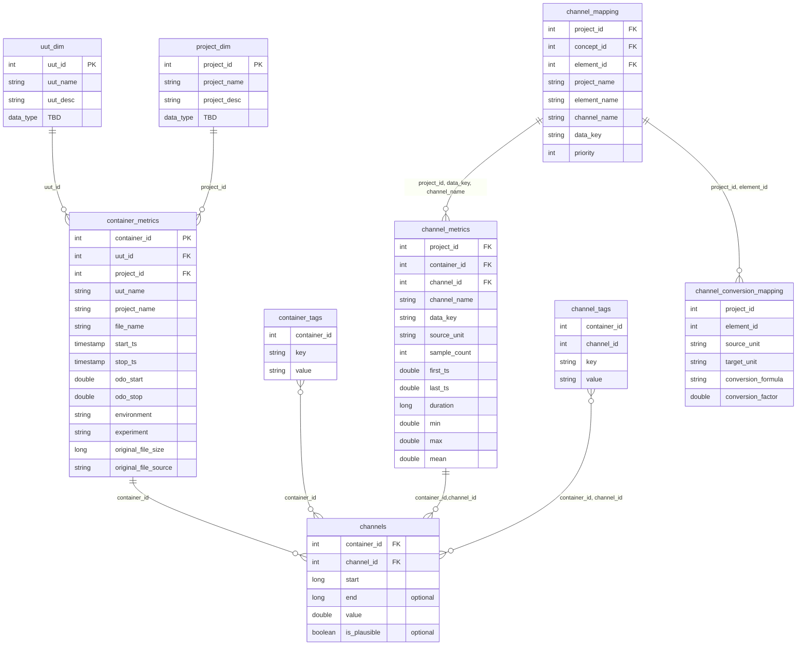

# Silver Layer - ER Diagram

The Silver layer stores measurement data in a tag-based normalized model. Core time-series data lives in `channels`,
while metadata is split across tag tables (key-value pairs) and metric tables (pre-computed statistics). 

> **`channels` format variants:**
> - **RLE format** -- both `start` and `end` are present (run-length encoded)
> - **Raw format** -- only `start` is present (`end` is computed on-the-fly via the query engine)