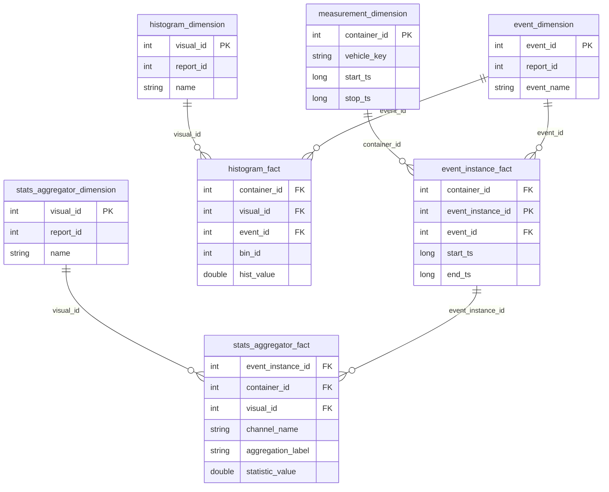

# Data Sources

Impulse reads measurement data from a **Silver layer** and writes structured analytics results to a **Gold
layer**. Both layers are stored in Unity Catalog as Delta Lake tables.

---

## Silver layer (input)

The Silver layer contains five tables that represent measurement data in a normalized, tag-based model. All table names
follow Unity Catalog naming: `catalog.schema.table`.

### container_tags

Key-value metadata tags for measurement containers.

| Column         | Type     | Nullable | Description                                     |
|----------------|----------|----------|-------------------------------------------------|
| `container_id` | `long`   | No       | Unique container identifier.                    |
| `key`          | `string` | Yes      | Tag key (e.g. `"vehicle_key"`, `"project_id"`). |
| `value`        | `string` | Yes      | Tag value.                                      |

### container_metrics

Numeric metadata for each container (timestamps, duration, channel count).

| Column         | Type        | Nullable | Description                          |
|----------------|-------------|----------|--------------------------------------|
| `container_id` | `long`      | No       | Unique container identifier.         |
| `start_dt`     | `timestamp` | Yes      | Container start datetime.            |
| `stop_dt`      | `timestamp` | Yes      | Container stop datetime.             |
| `duration_ms`  | `int`       | Yes      | Total duration in milliseconds.      |
| `num_channels` | `int`       | Yes      | Number of channels in the container. |

### channel_tags

Key-value metadata tags for individual channels within a container.

| Column         | Type     | Nullable | Description                                            |
|----------------|----------|----------|--------------------------------------------------------|
| `container_id` | `long`   | No       | Parent container identifier.                           |
| `channel_id`   | `int`    | No       | Channel identifier within the container.               |
| `key`          | `string` | Yes      | Tag key (e.g. `"channel_name"`, `"brand"`, `"model"`). |
| `value`        | `string` | Yes      | Tag value.                                             |

### channel_metrics

Numeric metadata and pre-computed statistics for individual channels.

| Column                  | Type     | Nullable | Description                       |
|-------------------------|----------|----------|-----------------------------------|
| `container_id`          | `long`   | No       | Parent container identifier.      |
| `channel_id`            | `int`    | No       | Channel identifier.               |
| `value_type`            | `string` | Yes      | Data type of channel values.      |
| `sample_count`          | `int`    | Yes      | Number of samples.                |
| `nan_ratio`             | `float`  | Yes      | Ratio of NaN values.              |
| `begin_s`               | `float`  | Yes      | Channel start time (seconds).     |
| `end_s`                 | `float`  | Yes      | Channel end time (seconds).       |
| `duration_ms`           | `int`    | Yes      | Channel duration in milliseconds. |
| `original_sample_count` | `int`    | Yes      | Sample count before processing.   |
| `original_sr`           | `float`  | Yes      | Original sample rate.             |
| `min`                   | `float`  | Yes      | Minimum value.                    |
| `max`                   | `float`  | Yes      | Maximum value.                    |
| `mean`                  | `float`  | Yes      | Mean value.                       |
| `std`                   | `float`  | Yes      | Standard deviation.               |
| `pz1`                   | `float`  | Yes      | 1st percentile.                   |
| `pz10`                  | `float`  | Yes      | 10th percentile.                  |
| `pz90`                  | `float`  | Yes      | 90th percentile.                  |
| `pz99`                  | `float`  | Yes      | 99th percentile.                  |

### channels

The actual time-series data. The table supports two format variants:

#### RLE format (default)

Pre-encoded with Run-Length Encoding. Each row represents one sample interval `[tstart, tend)` with a constant value.

| Column         | Type      | Nullable | Description                            |
|----------------|-----------|----------|----------------------------------------|
| `container_id` | `long`    | No       | Parent container identifier.           |
| `channel_id`   | `int`     | No       | Channel identifier.                    |
| `tstart`       | `long`    | No       | Sample start timestamp (microseconds). |
| `tend`         | `long`    | No       | Sample end timestamp (microseconds).   |
| `value`        | `double`  | Yes      | Sample value.                          |
| `is_plausible` | `boolean` | Yes      | Whether the data point is plausible.   |

#### Raw format (requires `data_type: RAW`)

Raw timestamp-based data without RLE encoding. Each row represents a single sample at a point in time.
When `data_type` is set to `RAW` in the config, the framework automatically derives `tend` from subsequent
timestamps and transforms data into a supported format before query execution.

| Column         | Type      | Nullable | Description                                 |
|----------------|-----------|----------|---------------------------------------------|
| `container_id` | `long`    | No       | Parent container identifier.                |
| `channel_id`   | `int`     | No       | Channel identifier.                         |
| `timestamp`    | `long`    | No       | Sample timestamp (microseconds).            |
| `value`        | `double`  | Yes      | Sample value.                               |
| `is_plausible` | `boolean` | Yes      | Whether the data point is plausible.         |

Consecutive rows for the same channel form a `SampleSeries`.

### channel_mapping

Optional alias-resolution table used by `KeyValueStoreSolver` when selectors are created via
`QueryBuilder.channel_with_alias()`. Each row maps a logical channel name (and optional priority) to one or more
physical channels keyed by `project_id` / `data_key`.

| Column           | Type     | Nullable | Description                                                                 |
|------------------|----------|----------|-----------------------------------------------------------------------------|
| `project_id`     | `int`    | No       | Project identifier the mapping belongs to.                                  |
| `concept_id`     | `int`    | No       | Concept identifier (foreign key to the concept table).                      |
| `element_id`     | `int`    | No       | Element identifier (foreign key to the concept-elements table).             |
| `project_name`   | `string` | Yes      | Human-readable project name.                                                |
| `element_name`   | `string` | Yes      | Human-readable element name.                                                |
| `channel_name`   | `string` | No       | Logical channel name to match against `channel_with_alias` selectors.       |
| `data_key`       | `string` | No       | Physical lookup key joined to `channel_metrics`.                            |
| `priority`       | `int`    | Yes      | Tie-breaker when multiple physical channels match a logical name.           |

Configured via `source.channel_mapping_table` (see [Configuration](../config/configuration)). Joins to
`channel_metrics` on `(project_id, data_key, channel_name)`.

---

## Gold layer (output)

The Gold layer uses a **star schema** to store analytics results. All table names are prefixed with the configured
`table_prefix`. For example, with `table_prefix = "my_report"`, tables are named `my_report_histogram_fact`,
`my_report_histogram_dimension`, etc.

### Schema overview



### Fact tables

| Table                          | Key Columns                                                                          | Description                                                  |
|--------------------------------|--------------------------------------------------------------------------------------|--------------------------------------------------------------|
| `{prefix}_histogram_fact`      | `container_id`, `visual_id`, `event_id`, `bin_id`                                    | 1D histogram bin values per container.                       |
| `{prefix}_histogram2d_fact`    | `container_id`, `visual_id`, `event_id`, `x_bin_id`, `y_bin_id`                      | 2D histogram bin values per container.                       |
| `{prefix}_stats_aggregator_fact` | `container_id`, `visual_id`, `event_instance_id`, `channel_name`, `aggregation_label` | Statistics values per signal, event instance, and container. |
| `{prefix}_event_instance_fact` | `container_id`, `event_id`, `event_instance_id`                                      | Materialized event occurrences with start/end timestamps.    |

### Dimension tables

| Table                            | Key Columns              | Description                                                |
|----------------------------------|--------------------------|------------------------------------------------------------|
| `{prefix}_histogram_dimension`   | `visual_id`, `report_id` | Histogram metadata (name, bins, signal info, units).       |
| `{prefix}_histogram2d_dimension` | `visual_id`, `report_id` | 2D histogram metadata (axes, bins, signal info, units).    |
| `{prefix}_stats_aggregator_dimension` | `visual_id`, `report_id` | Statistics metadata (signals, aggregation labels).         |
| `{prefix}_event_dimension`       | `event_id`, `report_id`  | Event definitions (name, expression, required channels).   |
| `{prefix}_measurement_dimension` | `container_id`           | Container metadata from configured measurement dimensions. |

---

## Configuration

Data source and sink are configured in the report's JSON configuration file. See the [Report](./report.md) reference for
the full configuration schema.

### Source configuration

Maps Silver layer tables to Unity Catalog paths:

```json
{
  "source": {
    "container_metrics_table": "catalog.schema.container_metrics",
    "channel_metrics_table": "catalog.schema.channel_metrics",
    "channels_uri": "catalog.schema.channels",
    "container_tags_table": "catalog.schema.container_tags",
    "channel_tags_table": "catalog.schema.channel_tags"
  }
}
```

| Field                     | Required | Description                                |
|---------------------------|----------|--------------------------------------------|
| `container_metrics_table` | Yes      | Container timestamps and numeric metadata. |
| `channel_metrics_table`   | Yes      | Channel-level statistics.                  |
| `channels_uri`            | Yes      | Raw time-series data.                      |
| `container_tags_table`    | No       | Container key-value tags.                  |
| `channel_tags_table`      | No       | Channel key-value tags.                    |

### Sink configuration

Defines where Gold layer tables are written:

```json
{
  "unity_sink": {
    "catalog": "my_catalog",
    "schema": "gold",
    "table_prefix": "my_report"
  }
}
```

| Field          | Required | Description                           |
|----------------|----------|---------------------------------------|
| `catalog`      | Yes      | Target Unity Catalog name.            |
| `schema`       | Yes      | Target schema name.                   |
| `table_prefix` | Yes      | Prefix for all generated table names. |

### Measurement dimensions

Controls which columns from `container_metrics` are included in the `measurement_dimension` table:

```json
{
  "measurement_dimensions": ["container_id", "vehicle_key", "start_ts", "stop_ts"]
}
```

Available dimension values: `container_id`, `uut_id`, `vehicle_key`, `file_name`, `source_file_path`, `start_ts`,
`stop_ts`, `environment`, `project_id`.

---
